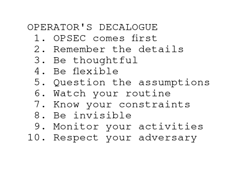

# Operator's Decalogue

## 10 OPSEC Principles of Offensive Operator

1. The most important matter in an operation is its security. Everything else must subordinate.
2. Carry out daily tasks with careful attention to details. It must be a habit.
3. Be thoughtful. Think before you do anything. Mistakes cannot, in principle, be undone.
4. Be ready for many scenarios. Don't count on luck or misfortune.
5. Question the assumptions. Check how their change or obsolescence affects the task.
6. Never get into a routine. Watch out for fatigue, stress, excitement, and overconfidence.
7. Know your constraints. When you lack knowledge or experience, get it.
8. Beware of anomalies. What you are doing must look like noise. Be invisible by being common.
9. Monitor your activities. Look at yourself through the eyes of your adversary.
10. Never underestimate your adversary. Assume he's better than you.

## Disputationem

The first rule does not need to be discussed in depth. Each operation is based on security. If any other factors become more important, its discovery and eventual failure is only a matter of time.

Each mission consists of a series of tasks, performed by assigned operators. Each such activity generates new traces that cannot be avoided because they come from the very nature of human activity and the space that surrounds us. Nothing happens in a vacuum. The entire operation can be compromised with an accumulation of small, sometimes unrelated factors, although unlike air accidents that occur as a chain of multiple events, in a cyber operation one small mistake is enough to lead to a catastrophe. Hence, keeping it in secret is so difficult. Every detail counts. Therefore, when you do or avoid to do something, it needs to be thought through, verified and tested before you make the next move. And never rush it when it's not absolutely necessary.

An operation is being carried out according to some initial plan. The plan is usually based on certain assumptions that may be incorrect or out of date. You should be ready for situations that you did not anticipate. This readiness is achieved by simulating multiple scenarios, practicing, and constantly trying and making mistakes. It is your experience that makes you flexible, and the speed of adaptation is directly proportional to your openness to many options. There is no situation without a solution. Sometimes doing nothing is a good strategy.

People involved in the operation are only humans with their own problems, needs or desires. Their psychophysical state has a direct impact on the course of the mission. Therefore, fatigue, burnout, constant stress, pressure, conflicts or even the usual routine lead to mistakes. It is thus important that operators have time to recover and rest, eat healthy and sleep.

You should also be aware that it is very much your adversary defining what resources and competences you need. What hardware, software, language, architecture, security is used, how it is organized and what daily routine it has. It all determines the way you interact. And in order to control your adversary, you must know and understand him very well.

You need to grasp your own limitations and the constraints of the tools used by operators. How they work, what traces do they leave behind, what noise they create in the operating system, what network traffic they generate. The adversary posses many systems assisting to detect events and anomalies, based on many information sources, like logs from perimeter devices, network activity, data and metadata in your malware, logs generated while operating on the machine, methods of persistence and transit in the internal network, or side effects (e.g. messages on the screen, unexpected machine restarts, etc.). When you know what your activity looks like, it will be easier to deceive the defender and bypass his alerting systems. The more you look like a system noise and not an anomaly, the longer you remain undetected.

To some extent, OPSEC resembles a game of chess - you have to anticipate moves a few steps ahead, evaluate the risk, and choose those that eliminate or at least minimize the cost. Keep in mind that the ultimate goal is to reduce the amount and quality of information available to the adversary; what, how and when he sees it, and how he interprets that information.

[source](https://blog.sektor7.net/#!res/2021/opdec.md)